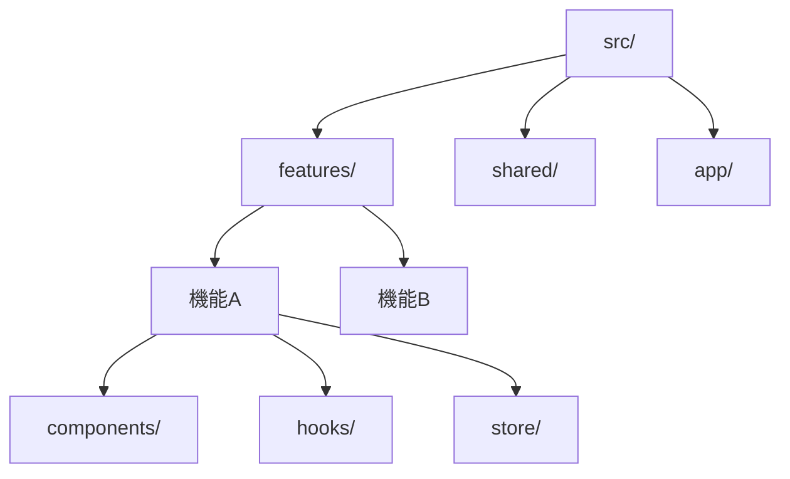

# パッケージ構造ルールの整備に関する知見

## 1. 背景と目的

パッケージ構造の整備は、大規模なTypeScript + Reactプロジェクトの保守性と拡張性に重要な影響を与えます。Package by Featureの原則とコロケーションを中心とした構造化により、以下の利点が得られることが分かりました。

## 2. 主要な発見

### 2.1 Package by Featureの効果

1. モジュール性の向上
   - 機能単位での独立性が高まる
   - チーム間の並行開発が容易になる
   - 機能の追加・削除が容易

2. コードの求心性
   - 関連するコードが近接して配置される
   - コードの把握が容易になる
   - 変更の影響範囲が明確

### 2.2 コロケーションの重要性

1. メンテナンス性の向上
   - テストとコンポーネントの関係が明確
   - スタイルの管理が容易
   - ドキュメントの更新が確実

2. 開発効率の向上
   - ファイル間の移動が最小限
   - 関連する変更が一箇所で完結
   - レビューが効率的

## 3. 技術的な判断

### 3.1 ディレクトリ構造の決定

この構造を選択した理由：
1. 機能の独立性を最大化
2. 共有リソースの明確な分離
3. 依存関係の可視化

### 3.2 命名規則の統一

1. ディレクトリ名：PascalCase
   - コンポーネントとの一貫性
   - 視覚的な区別が容易

2. ファイル名：機能を反映
   - 目的が明確
   - 検索が容易
   - 型と実装の関係が明確

## 4. 得られた教訓

### 4.1 成功したアプローチ

1. 明確な階層構造
   - 機能 → コンポーネント → 実装の流れ
   - 依存関係の一方向性
   - スケーラビリティの確保

2. テストの配置
   - 実装との近接性
   - カバレッジの可視性
   - メンテナンスの容易さ

### 4.2 注意点

1. 共有リソースの管理
   - 適切な抽象化レベル
   - 再利用性の基準
   - 更新の影響範囲

2. バンドルサイズ
   - 動的インポートの活用
   - 共有モジュールの最適化
   - Tree Shakingの考慮

## 5. 今後の改善案

### 5.1 短期的な改善

1. エディタ設定の整備
   - パス解決の自動化
   - コード生成テンプレート
   - リンター・フォーマッターの統一

2. ドキュメント整備
   - READMEテンプレート
   - コンポーネント規約
   - API文書化規約

### 5.2 長期的な検討事項

1. モノレポ化の検討
   - 機能の分割粒度
   - 共有リソースの管理
   - ビルド最適化

2. マイクロフロントエンド
   - 機能の独立性
   - デプロイメント戦略
   - 状態管理の分離

## 6. 次のステップ

1. エディタ設定の整備
2. テンプレートの作成
3. CI/CDパイプラインの更新
4. チーム研修資料の作成

## 更新履歴

- 2025-03-08: 初版作成
  - Package by Featureの原則を確立
  - コロケーションルールを整備
  - ディレクトリ構造と命名規則を統一