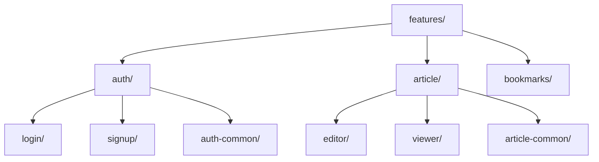

# Package by Feature の階層化による改善に関する知見

## 1. 背景

従来のPackage by Featureアプローチでは、機能単位での分割は行っていたものの、関連する機能間の関係性が明確でなく、共通コンポーネントの再利用にも課題がありました。これを解決するため、機能グループという概念を導入し、階層構造を改善しました。

## 2. 主要な改善点

### 2.1 機能グループの導入



1. グループ化の基準
   - ユーザーの文脈で関連する機能
   - データモデルの共有度
   - 状態管理の関連性

2. 期待される効果
   - コードの求心性の向上
   - チーム間の責任範囲の明確化
   - 機能間の依存関係の可視化

### 2.2 共通コンポーネントの2層構造

1. グループ内共通（features/[group]/common/）
   - グループ特有のUIコンポーネント
   - グループ内で共有される型定義
   - グループ固有のユーティリティ

2. プロジェクト全体共通（src/common/）
   - 汎用UIコンポーネント
   - グローバルな型定義
   - プロジェクト全体で使用するユーティリティ

## 3. 得られた知見

### 3.1 構造化のメリット

1. 開発効率の向上
   - 関連機能へのアクセスが容易
   - コンポーネントの再利用が明確
   - 変更の影響範囲が予測可能

2. メンテナンス性の向上
   - 機能の追加・削除が容易
   - 依存関係の管理が容易
   - リファクタリングの範囲が明確

3. チーム開発の効率化
   - 担当範囲の明確化
   - 並行開発の促進
   - コードレビューの効率化

### 3.2 実装時の注意点

1. グループ分けの基準
   - ユーザーストーリーの関連性
   - データフローの共通性
   - 機能の結合度と凝集度

2. 共通コンポーネントの判断基準
   - 使用頻度
   - カスタマイズの必要性
   - メンテナンスコスト

## 4. 実装例

### 4.1 認証機能グループの例

```typescript
// features/auth/common/types/user.ts
export type User = {
  id: string;
  name: string;
  role: UserRole;
};

// features/auth/login/components/LoginForm.tsx
import { User } from '../../common/types/user';
import { Button } from '@/common/components/Button';
```

### 4.2 記事機能グループの例

```typescript
// features/article/common/hooks/useArticleData.ts
export const useArticleData = () => {
  // グループ内で共有される記事データの取得ロジック
};

// features/article/editor/components/Editor.tsx
import { useArticleData } from '../../common/hooks/useArticleData';
import { TextField } from '@/common/components/TextField';
```

## 5. 今後の展開

### 5.1 短期的な改善

1. 自動生成ツールの開発
   - 機能グループのテンプレート
   - 共通コンポーネントの雛形
   - 型定義の自動生成

2. ドキュメントの整備
   - グループ分けのガイドライン
   - コンポーネント設計パターン
   - 依存関係の管理ルール

### 5.2 長期的な展望

1. マイクロフロントエンド化
   - 機能グループ単位のデプロイ
   - 独立したビルド・テスト
   - 状態管理の分離

2. パフォーマンス最適化
   - グループ単位のコード分割
   - 共通モジュールのバンドル最適化
   - 遅延ロードの戦略

## 6. 次のステップ

1. 既存プロジェクトの段階的移行計画の策定
2. チーム向けのトレーニング資料の作成
3. CI/CDパイプラインの更新
4. パフォーマンスモニタリングの導入

## 更新履歴

- 2025-03-08: 初版作成
  - Package by Featureの階層化を提案
  - 共通コンポーネントの2層構造を定義
  - 実装例と注意点を追加